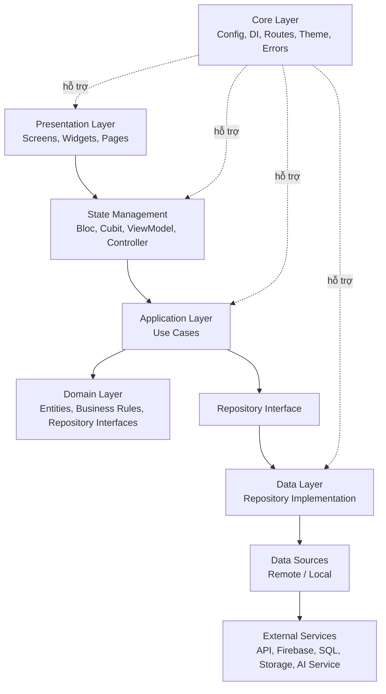
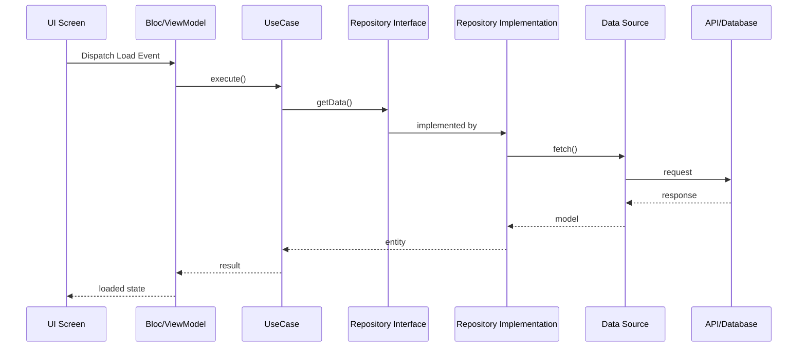

# General Clean Architecture Guide

> Tài liệu này mô tả một kiến trúc Clean Architecture tổng quát, có thể áp dụng cho nhiều loại dự án như Flutter app, web app, backend API, mobile app, hoặc hệ thống có admin/user.  
> Mục tiêu chính: code dễ đọc, dễ test, dễ thay đổi backend/database/UI mà không phá toàn bộ hệ thống.

---

## 1. Ý tưởng chính của Clean Architecture

Clean Architecture chia dự án thành nhiều lớp. Mỗi lớp có trách nhiệm riêng và chỉ phụ thuộc theo một chiều từ ngoài vào trong.

```text
Presentation / UI
    ↓
Application / Use Cases
    ↓
Domain / Business Rules
    ↑
Data / Infrastructure implements interfaces
```

Nguyên tắc quan trọng nhất:

```text
Code bên trong không được phụ thuộc vào code bên ngoài.
Domain không được biết Flutter, Firebase, HTTP, SQL, API, UI.
```

Ví dụ:

```text
Đúng:
UI -> Bloc/ViewModel -> UseCase -> Repository Interface

Sai:
UI -> Firebase trực tiếp
UseCase -> HTTP client trực tiếp
Domain Entity -> import Firebase package
```

---

## 2. Sơ đồ tổng quan



---

## 3. Cấu trúc thư mục tổng quát

```text
lib/
  main.dart
  app.dart

  core/
    config/
    constants/
    errors/
    network/
    routes/
    theme/
    utils/
    di/

  features/
    auth/
      presentation/
        pages/
        widgets/
        bloc/
      application/
        usecases/
      domain/
        entities/
        repositories/
        value_objects/
      data/
        models/
        datasources/
        repositories/

    product/
      presentation/
      application/
      domain/
      data/

    order/
      presentation/
      application/
      domain/
      data/

    profile/
      presentation/
      application/
      domain/
      data/
```

Với backend, có thể dùng cấu trúc tương tự:

```text
src/
  main.ts / main.py / app.js

  core/
    config/
    errors/
    middleware/
    database/
    security/
    logger/

  features/
    auth/
      presentation/
        controllers/
        routes/
        dto/
      application/
        usecases/
      domain/
        entities/
        repositories/
        services/
      infrastructure/
        models/
        repositories/
        datasources/

    product/
      presentation/
      application/
      domain/
      infrastructure/

    order/
      presentation/
      application/
      domain/
      infrastructure/
```

---

## 4. Giải thích từng layer

## 4.1 Presentation Layer

Presentation là lớp giao diện hoặc lớp nhận request.

Trong Flutter/mobile/web, Presentation gồm:

```text
screens
pages
widgets
bloc/cubit/viewmodel/controller
form state
UI validation nhẹ
```

Trong backend, Presentation gồm:

```text
routes
controllers
request dto
response dto
middleware nhận request
```

Nhiệm vụ:

```text
Hiển thị dữ liệu
Nhận input từ người dùng
Gửi event/action đến UseCase
Render loading/success/error
Không xử lý business logic phức tạp
Không gọi database/API trực tiếp
```

Ví dụ Flutter:

```text
LoginScreen
  -> người dùng nhập email/password
  -> bấm Login
  -> SignInBloc nhận event
```

Ví dụ backend:

```text
POST /products
  -> ProductController nhận request
  -> gọi CreateProductUseCase
```

Không nên làm trong Presentation:

```text
Không viết logic tính toán nghiệp vụ phức tạp
Không gọi Firebase/SQL/HTTP trực tiếp
Không parse database document trực tiếp trong UI
```

---

## 4.2 State Management Layer

State Management là phần trung gian giữa UI và UseCase.

Có thể dùng:

```text
Bloc
Cubit
Provider
Riverpod Notifier
ViewModel
Controller
```

Nhiệm vụ:

```text
Nhận event/action từ UI
Gọi UseCase
Quản lý trạng thái loading/success/error
Đưa dữ liệu sạch cho UI render
```

Ví dụ:

```text
SignInBloc
  Event: SignInRequested(email, password)
  State: initial, loading, success, failure
  UseCase: SignInUseCase
```

State Management không nên:

```text
Không chứa code Firebase trực tiếp
Không chứa SQL query
Không xử lý quá nhiều business rules
Không biến thành service khổng lồ
```

---

## 4.3 Application Layer / Use Cases

Application Layer chứa các hành động mà app có thể làm.

Ví dụ:

```text
SignInUseCase
CreateProductUseCase
GetProductListUseCase
AddToCartUseCase
CreateOrderUseCase
UpdateUserProfileUseCase
UploadImageUseCase
```

Nhiệm vụ:

```text
Điều phối nghiệp vụ
Gọi repository interface
Kiểm tra rule cấp use case
Trả kết quả về cho Bloc/ViewModel/Controller
```

Ví dụ:

```text
CreateProductUseCase
  1. Kiểm tra user có quyền admin không
  2. Kiểm tra dữ liệu product hợp lệ
  3. Gọi ProductRepository.createProduct()
  4. Trả success/failure
```

UseCase nên phụ thuộc vào interface, không phụ thuộc vào implementation cụ thể.

Đúng:

```text
CreateProductUseCase -> ProductRepository
```

Sai:

```text
CreateProductUseCase -> FirebaseProductRepository
CreateProductUseCase -> Firestore directly
```

---

## 4.4 Domain Layer

Domain là lớp quan trọng nhất. Đây là phần lõi của hệ thống.

Domain gồm:

```text
entities
value objects
repository interfaces
domain services
business rules
domain errors
```

Nhiệm vụ:

```text
Định nghĩa dữ liệu cốt lõi
Định nghĩa quy tắc nghiệp vụ
Không phụ thuộc framework
Không phụ thuộc database
Không phụ thuộc UI
```

Ví dụ entity:

```text
User
Product
Pizza
Order
CartItem
Payment
MoodLog
Song
```

Ví dụ business rule:

```text
Order không được tạo nếu cart rỗng
Product price không được âm
Admin mới được tạo/sửa/xóa product
User chỉ được xem order của chính mình
```

Ví dụ repository interface:

```text
abstract class ProductRepository {
  Future<List<Product>> getProducts();
  Future<void> createProduct(Product product);
  Future<void> updateProduct(Product product);
  Future<void> deleteProduct(String id);
}
```

Domain không nên import:

```text
firebase
http
dio
flutter
express
fastapi
sql client
storage sdk
```

---

## 4.5 Data Layer / Infrastructure Layer

Data Layer là nơi kết nối với thế giới bên ngoài.

Nó gồm:

```text
repository implementations
remote data sources
local data sources
models
mappers
API clients
Firebase clients
SQL/NoSQL clients
Storage clients
AI service clients
```

Nhiệm vụ:

```text
Gọi API
Gọi Firebase
Gọi database
Upload file
Parse JSON/document
Map model/entity
Implement repository interface từ Domain
```

Ví dụ:

```text
ProductRepository interface nằm ở domain
FirebaseProductRepository nằm ở data
```

Luồng:

```text
UseCase
  -> ProductRepository interface
  -> FirebaseProductRepository implementation
  -> FirestoreProductDataSource
  -> Firebase Firestore
```

Data Layer được phép biết Firebase/API/SQL, nhưng Domain thì không.

---

## 4.6 Core Layer

Core là nơi chứa code dùng chung toàn app.

```text
core/
  config/
  constants/
  errors/
  network/
  routes/
  theme/
  utils/
  di/
```

Nhiệm vụ:

```text
Cấu hình môi trường
Dependency injection
Route chung
Theme chung
Error/failure chung
Network client chung
Helper function chung
```

Không nên nhét business logic của feature vào core.

Ví dụ không nên:

```text
core/order/order_calculator.dart
core/product/product_validator.dart
```

Nếu logic đó thuộc order/product, hãy để trong feature tương ứng.

---

## 5. Luồng dữ liệu chuẩn

## 5.1 Luồng đọc dữ liệu

```text
User mở màn hình
  ↓
UI gửi event LoadData
  ↓
Bloc/ViewModel gọi UseCase
  ↓
UseCase gọi Repository Interface
  ↓
Repository Implementation gọi DataSource
  ↓
DataSource gọi API/Database
  ↓
Model parse response
  ↓
Repository map Model -> Entity
  ↓
UseCase trả Entity/List<Entity>
  ↓
Bloc emit Loaded State
  ↓
UI render dữ liệu
```

Sơ đồ:



---

## 5.2 Luồng ghi dữ liệu

```text
User nhập form
  ↓
UI validate cơ bản
  ↓
Bloc nhận Submit Event
  ↓
UseCase validate nghiệp vụ
  ↓
Repository lưu dữ liệu
  ↓
DataSource gọi API/Database
  ↓
Trả success/failure
  ↓
UI hiện thông báo
```

Ví dụ:

```text
Create Product
  -> nhập name, price, image
  -> upload image
  -> lấy imageUrl
  -> tạo Product entity
  -> ProductRepository.createProduct()
  -> Firestore/API lưu product
```

---

## 6. Dependency Rule

Quy tắc phụ thuộc:

```text
Presentation -> Application -> Domain
Data -> Domain
Application -> Domain
```

Nghĩa là:

```text
UI biết UseCase
UseCase biết Repository Interface
Repository Implementation biết DataSource
DataSource biết API/Firebase/SQL
Domain không biết ai ở ngoài
```

Không nên:

```text
Domain -> Data
Domain -> Presentation
UseCase -> Firebase
Entity -> JSON parser phụ thuộc framework
```

---

## 7. Repository Pattern

Repository là cổng trung gian giữa nghiệp vụ và dữ liệu.

Có 2 phần:

```text
1. Repository Interface ở Domain
2. Repository Implementation ở Data
```

Ví dụ:

```text
domain/repositories/product_repository.dart
data/repositories/product_repository_impl.dart
```

Repository giúp:

```text
Thay Firebase bằng REST API mà không sửa UseCase
Thay PostgreSQL bằng MongoDB mà không sửa Domain
Test UseCase bằng mock repository
Tách business logic khỏi data source
```

---

## 8. Model, Entity, DTO khác nhau như thế nào?

## 8.1 Entity

Entity là dữ liệu cốt lõi trong domain.

```text
Product
User
Order
Cart
```

Entity không nên phụ thuộc JSON/Firebase.

Ví dụ:

```text
Product {
  id
  name
  price
  description
}
```

---

## 8.2 Model

Model thường nằm ở Data Layer, dùng để parse dữ liệu từ API/Database.

```text
ProductModel.fromJson()
ProductModel.toJson()
ProductModel.fromFirestore()
```

Model có thể chuyển sang Entity:

```text
ProductModel -> Product
```

---

## 8.3 DTO

DTO thường nằm ở Presentation/API layer, dùng để nhận request hoặc trả response.

Backend thường dùng DTO nhiều hơn Flutter.

Ví dụ:

```text
CreateProductRequestDto
ProductResponseDto
UpdateUserRequestDto
```

---

## 9. Dependency Injection

Dependency Injection dùng để nối các layer lại với nhau.

Ví dụ:

```text
Bloc cần UseCase
UseCase cần Repository Interface
Repository Implementation cần DataSource
DataSource cần HTTP/Firebase client
```

Thay vì tự tạo thủ công trong từng màn hình, ta đăng ký ở một nơi:

```text
di/
  injection_container.dart
```

Ví dụ:

```text
registerLazySingleton<ProductRemoteDataSource>()
registerLazySingleton<ProductRepository>(() => ProductRepositoryImpl(remoteDataSource))
registerLazySingleton<GetProductsUseCase>(() => GetProductsUseCase(productRepository))
registerFactory<ProductBloc>(() => ProductBloc(getProductsUseCase))
```

Lợi ích:

```text
Dễ test
Dễ thay implementation
Không phải khởi tạo dependency lặp lại
Code UI sạch hơn
```

---

## 10. Error Handling chuẩn

Nên có lỗi thống nhất.

```text
core/errors/
  failure.dart
  exception.dart
```

Ví dụ Failure:

```text
NetworkFailure
ServerFailure
UnauthorizedFailure
ValidationFailure
NotFoundFailure
UnknownFailure
```

DataSource có thể throw Exception:

```text
ServerException
NetworkException
CacheException
```

Repository bắt Exception và đổi thành Failure:

```text
try {
  final data = await remoteDataSource.getProducts();
  return Success(data);
} catch (e) {
  return Failure(ServerFailure());
}
```

Bloc/ViewModel chỉ nhận Failure để hiển thị lỗi phù hợp.

---

## 11. Feature-based Clean Architecture

Thay vì chia theo kiểu:

```text
screens/
models/
services/
repositories/
```

Nên chia theo feature:

```text
features/
  auth/
  product/
  order/
  cart/
  profile/
```

Mỗi feature tự có:

```text
presentation/
application/
domain/
data/
```

Lợi ích:

```text
Dễ tìm code
Dễ xóa/sửa một feature
Team làm song song dễ hơn
Scale tốt hơn
```

---

## 12. Template cho Flutter App

```text
lib/
  main.dart
  app.dart

  core/
    config/
      app_config.dart
    constants/
      app_constants.dart
    errors/
      failures.dart
      exceptions.dart
    routes/
      app_router.dart
    theme/
      app_theme.dart
    utils/
    di/
      injection_container.dart

  features/
    auth/
      presentation/
        pages/
          login_page.dart
          register_page.dart
        widgets/
          login_form.dart
        bloc/
          auth_bloc.dart
          auth_event.dart
          auth_state.dart
      application/
        usecases/
          sign_in_usecase.dart
          sign_out_usecase.dart
          get_current_user_usecase.dart
      domain/
        entities/
          user.dart
        repositories/
          auth_repository.dart
      data/
        models/
          user_model.dart
        datasources/
          auth_remote_datasource.dart
          auth_local_datasource.dart
        repositories/
          auth_repository_impl.dart

    product/
      presentation/
        pages/
          product_list_page.dart
          product_detail_page.dart
          create_product_page.dart
        widgets/
          product_card.dart
        bloc/
          product_bloc.dart
          product_event.dart
          product_state.dart
      application/
        usecases/
          get_products_usecase.dart
          create_product_usecase.dart
          update_product_usecase.dart
          delete_product_usecase.dart
      domain/
        entities/
          product.dart
        repositories/
          product_repository.dart
      data/
        models/
          product_model.dart
        datasources/
          product_remote_datasource.dart
        repositories/
          product_repository_impl.dart
```

---

## 13. Template cho Backend API

```text
src/
  main.ts
  app.ts

  core/
    config/
    errors/
    middleware/
    database/
    logger/
    security/

  features/
    auth/
      presentation/
        routes/
          auth_routes.ts
        controllers/
          auth_controller.ts
        dto/
          sign_in_request.dto.ts
          auth_response.dto.ts
      application/
        usecases/
          sign_in.usecase.ts
          sign_out.usecase.ts
          get_current_user.usecase.ts
      domain/
        entities/
          user.entity.ts
        repositories/
          auth_repository.ts
      infrastructure/
        models/
          user_model.ts
        repositories/
          firebase_auth_repository.ts
        datasources/
          firebase_auth_datasource.ts

    product/
      presentation/
        routes/
        controllers/
        dto/
      application/
        usecases/
      domain/
        entities/
        repositories/
      infrastructure/
        models/
        repositories/
        datasources/
```

---

## 14. Ví dụ áp dụng cho Pizza App có Admin

```text
features/
  auth/
    presentation/
    application/
    domain/
    data/

  pizza/
    presentation/
      pages/
        pizza_list_page.dart
        pizza_detail_page.dart
        create_pizza_page.dart
        update_pizza_page.dart
      bloc/
        pizza_bloc.dart
        create_pizza_bloc.dart
        upload_pizza_image_bloc.dart
    application/
      usecases/
        get_pizzas_usecase.dart
        create_pizza_usecase.dart
        update_pizza_usecase.dart
        delete_pizza_usecase.dart
        upload_pizza_image_usecase.dart
    domain/
      entities/
        pizza.dart
        macros.dart
      repositories/
        pizza_repository.dart
    data/
      models/
        pizza_model.dart
        macros_model.dart
      datasources/
        pizza_remote_datasource.dart
        pizza_storage_datasource.dart
      repositories/
        pizza_repository_impl.dart

  cart/
    presentation/
    application/
    domain/
    data/

  order/
    presentation/
    application/
    domain/
    data/

  admin/
    presentation/
      pages/
        admin_dashboard_page.dart
        manage_orders_page.dart
        manage_pizzas_page.dart
    application/
    domain/
    data/
```

Luồng tạo pizza:

```text
Admin CreatePizzaPage
  -> CreatePizzaBloc
  -> UploadPizzaImageUseCase
  -> CreatePizzaUseCase
  -> PizzaRepository Interface
  -> PizzaRepositoryImpl
  -> Firebase/REST API/Database
```

---

## 15. Ví dụ áp dụng cho Mental Health App

```text
features/
  mood/
    presentation/
      pages/
        mood_checkin_page.dart
        mood_history_page.dart
      bloc/
        mood_bloc.dart
    application/
      usecases/
        create_mood_log_usecase.dart
        get_mood_history_usecase.dart
    domain/
      entities/
        mood_log.dart
      repositories/
        mood_repository.dart
    data/
      models/
        mood_log_model.dart
      datasources/
        mood_remote_datasource.dart
      repositories/
        mood_repository_impl.dart

  meditation/
    presentation/
    application/
    domain/
    data/

  music/
    presentation/
    application/
    domain/
    data/

  journal/
    presentation/
    application/
    domain/
    data/

  ai_assistant/
    presentation/
    application/
    domain/
    data/
```

Luồng mood check-in:

```text
MoodCheckinPage
  -> MoodBloc
  -> CreateMoodLogUseCase
  -> MoodRepository
  -> MoodRepositoryImpl
  -> MoodRemoteDataSource
  -> API/Database
```

---

## 16. Những lỗi thường gặp khi áp dụng Clean Architecture

## 16.1 UI gọi Firebase trực tiếp

Sai:

```text
LoginButton -> FirebaseAuth.signIn()
```

Đúng:

```text
LoginButton -> SignInBloc -> SignInUseCase -> AuthRepository
```

---

## 16.2 UseCase gọi HTTP trực tiếp

Sai:

```text
GetProductsUseCase -> http.get()
```

Đúng:

```text
GetProductsUseCase -> ProductRepository.getProducts()
```

---

## 16.3 Domain import package ngoài

Sai:

```text
domain/entities/user.dart import firebase_auth
```

Đúng:

```text
domain/entities/user.dart không import framework ngoài
```

---

## 16.4 Tất cả code dồn vào Bloc

Sai:

```text
Bloc validate business rule
Bloc gọi Firebase
Bloc parse JSON
Bloc map model
Bloc xử lý upload
```

Đúng:

```text
Bloc nhận event
Bloc gọi UseCase
Bloc emit state
```

---

## 16.5 Chia folder theo kỹ thuật thay vì feature

Khó scale:

```text
screens/
blocs/
models/
repositories/
services/
```

Dễ scale hơn:

```text
features/
  auth/
  product/
  order/
```

---

## 17. Checklist khi refactor dự án sang Clean Architecture

```text
[ ] Xác định các feature chính
[ ] Tạo folder features/<feature_name>
[ ] Mỗi feature có presentation/application/domain/data
[ ] Chuyển UI vào presentation
[ ] Chuyển Bloc/ViewModel vào presentation
[ ] Tạo entity trong domain
[ ] Tạo repository interface trong domain
[ ] Tạo usecase trong application
[ ] Tạo model trong data
[ ] Tạo datasource trong data
[ ] Tạo repository implementation trong data
[ ] Đăng ký dependency injection
[ ] UI chỉ gọi Bloc/ViewModel
[ ] Bloc/ViewModel chỉ gọi UseCase
[ ] UseCase chỉ gọi Repository Interface
[ ] RepositoryImpl gọi DataSource
[ ] DataSource gọi API/Firebase/SQL
[ ] Viết test cho UseCase bằng mock Repository
```

---

## 18. Khi nào không cần Clean Architecture quá nặng?

Không phải dự án nào cũng cần chia quá sâu.

Với app nhỏ, có thể dùng bản rút gọn:

```text
features/
  auth/
    presentation/
    domain/
    data/
```

Hoặc:

```text
features/
  auth/
    pages/
    bloc/
    models/
    repository/
```

Nhưng nếu dự án có:

```text
nhiều feature
admin/user
backend thật
database
payment
AI service
team nhiều người
cần test nghiêm túc
```

thì nên dùng Clean Architecture đầy đủ.

---

## 19. Quy tắc đặt tên

Nên thống nhất:

```text
feature_name/
  presentation/
  application/
  domain/
  data/
```

Tên file nên dùng snake_case:

```text
create_pizza_usecase.dart
pizza_repository.dart
pizza_repository_impl.dart
pizza_remote_datasource.dart
create_pizza_bloc.dart
create_pizza_event.dart
create_pizza_state.dart
```

Tránh:

```text
SongModel.dart
reposiroties
usescases
basa
```

---

## 20. Kết luận

Clean Architecture giúp dự án dễ mở rộng hơn vì mỗi phần có trách nhiệm rõ ràng.

Luồng nên nhớ:

```text
UI
  -> State Management
  -> UseCase
  -> Repository Interface
  -> Repository Implementation
  -> DataSource
  -> API/Database/Firebase
```

Nguyên tắc quan trọng:

```text
Domain là lõi.
Domain không phụ thuộc framework.
UseCase điều phối nghiệp vụ.
Repository che giấu nguồn dữ liệu.
Data Layer kết nối thế giới bên ngoài.
Presentation chỉ hiển thị và gửi action.
```

Khi áp dụng đúng, bạn có thể thay Firebase bằng REST API, thay UI Flutter bằng Web, hoặc thêm backend mới mà không phải viết lại toàn bộ nghiệp vụ.
