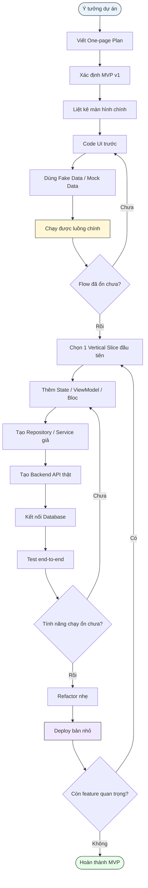

# HealTrack One-page Plan + Solo Project Harness

Bộ tài liệu này tổng hợp plan cho một app health tracking hằng ngày theo hướng tối giản:

- Theo dõi bữa ăn mỗi ngày.
- Scan ingredient / barcode / nhãn sản phẩm.
- Tính calo và macro ở mức ước lượng.
- Gợi ý lịch tập theo thời gian rảnh.
- Đồng bộ hoặc chuẩn bị tích hợp Google Calendar.
- Phát triển theo flow UI-first → Mock Data → Vertical Slice → Backend → Database → E2E → Deploy.

## Cách dùng nhanh

Đọc theo thứ tự:

```text
01_one_page_plan.md
02_mvp_scope.md
03_main_screens.md
04_development_flow.md
05_solo_project_harness.md
06_clean_architecture.md
07_vertical_slice_backlog.md
08_mock_data_and_api_contracts.md
09_reference_projects.md
```

## Flow phát triển chính



## Nguyên tắc sản phẩm

```text
Đơn giản trước.
UI chạy được trước.
Mock data trước.
Chỉ chọn một vertical slice để làm thật.
Không làm AI scan ảnh phức tạp ngay từ đầu.
Không tạo áp lực về cân nặng hay ngoại hình.
Tập trung vào thói quen, năng lượng, bữa ăn, vận động nhẹ và lịch cá nhân.
```
