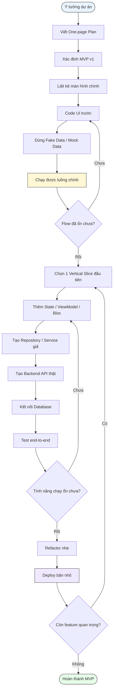

# Development Flow

## Flow tổng quát



---

## Cách áp dụng thực tế

## Step 1: Viết One-page Plan

Output:

```text
01_one_page_plan.md
```

Không code trước khi chưa rõ:

```text
App giải quyết vấn đề gì?
Ai dùng?
MVP v1 gồm gì?
Không làm gì?
```

---

## Step 2: Xác định MVP v1

Output:

```text
02_mvp_scope.md
```

MVP v1 phải nhỏ:

```text
Dashboard
Add meal thủ công
Nutrition summary
Workout suggestion mock
Calendar slot mock
```

---

## Step 3: Liệt kê màn hình chính

Output:

```text
03_main_screens.md
```

Mục tiêu là biết app cần bao nhiêu màn hình trước khi code.

---

## Step 4: Code UI trước

Chỉ dựng UI, chưa cần API.

```text
DashboardPage
AddMealPage
ScanIngredientPage
WorkoutPlanPage
ProfilePage
```

Không nên code backend ngay lúc này.

---

## Step 5: Dùng Fake Data / Mock Data

Tạo:

```text
mock_meals.dart
mock_workouts.dart
mock_calendar_slots.dart
mock_ingredient_scan.dart
```

Mục tiêu:

```text
UI có dữ liệu để render.
Flow chạy được dù chưa có backend.
```

---

## Step 6: Chạy được luồng chính

Luồng đầu tiên cần chạy:

```text
Dashboard
→ Add Meal
→ Confirm
→ Back Dashboard
→ Calories updated
```

Nếu flow chưa ổn, quay lại UI.

---

## Step 7: Chọn một Vertical Slice

Không làm nhiều feature cùng lúc.

Vertical slice đầu tiên:

```text
Meal Log Slice
```

Vì nó là lõi của app.

---

## Step 8: Thêm State / Bloc

Sau khi UI ổn mới thêm state.

```text
NutritionBloc
DashboardBloc
WorkoutBloc
CalendarBloc
```

---

## Step 9: Tạo Repository / Service giả

```text
NutritionRepository interface
FakeNutritionRepository implementation
```

Mục tiêu:

```text
Bloc không phụ thuộc trực tiếp mock data.
Sau này thay Fake bằng API thật dễ hơn.
```

---

## Step 10: Tạo Backend API thật

Chỉ tạo API cho slice đang làm.

Ví dụ Meal Log:

```text
GET /meals/today
POST /meals
DELETE /meals/{id}
```

---

## Step 11: Kết nối Database

Chọn đơn giản:

```text
Firebase Firestore nếu muốn nhanh
SQLite local nếu solo/offline
PostgreSQL nếu muốn backend nghiêm túc
```

---

## Step 12: Test end-to-end

Checklist:

```text
App add meal được
API nhận request đúng
Database lưu được
Mở lại app vẫn thấy dữ liệu
Dashboard tính đúng
```

---

## Step 13: Refactor nhẹ

Chỉ refactor sau khi feature chạy.

```text
Đổi tên file
Tách widget
Tách mapper
Chuẩn hóa error handling
Viết test cơ bản
```

---

## Step 14: Deploy bản nhỏ

Deploy sớm để tránh dự án nằm mãi ở local.

```text
Backend: Render/Fly.io/Railway/Firebase
Flutter web optional: Firebase Hosting/Vercel
Android APK internal test
```
